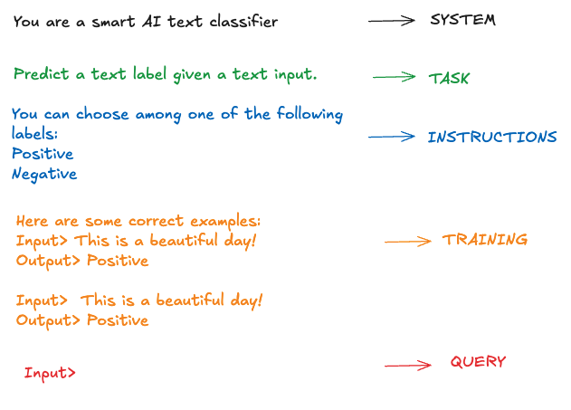

<h1>
  
  PROMPTy
</h1>

A Python package for prompt optimization and prototyping.

PROMPTy allows users to quickly optimize or prototype prompts for large language models. It provides tools for templating prompts using LLMs and optimizing them using either:

- *Bayesian Optimization*
- *Genetic Algorithms*

The idea stems from the fact that most NLP prompt templates (classification, translation, summarization, etc) can be broken down to 5 key components:

- **SYSTEM DESCRIPTION**
- **TASK DESCRIPTION**
- **INSTRUCTIONS**
- **TRAINING (SHOTS)**
- **USER QUERY**

We can treat the above as separate parameters that influence the final model generation. We can ask an LLM to come up with suitable (5-10-20) candidates for each, except the TRAININIG block. For TRAINING, assuming we have a large training set with labelled examples, we can employ several techniques to come up with the most relevant (n) shots. Once we have the candidates, we have our own search space we can optimize across.

<h1>
  
</h1>

## Features

### Optimization

| Optimization algorithm             | Status   | Notes                                                   |
|------------------------------------|----------|---------------------------------------------------------|
| Bayesian Optimization              | ✅       | Optuna, Hyperopt                                        |
| Genetic Algorithms                 | ✅       | DEAP                                                    |

### Tracing and Evaluation

| Tracing framework             | Status   | Notes                                                   |
|-------------------------------|----------|---------------------------------------------------------|
| ML Flow                       | ✅       | Tracing of trials, metrics, parameters                  |
| Weights and Biases            | ✅       | Tracing of trials, metrics, parameters                  |

## Installation

```bash
pip install prompty
```

Or clone the repository and install locally:

```bash
git clone https://github.com/yourusername/prompty.git
cd prompty
pip install -e .
```

## Quick Start

```python
import asyncio
import logging
import os

import mlflow
import pandas as pd
from dotenv import load_dotenv
from jinja2 import DebugUndefined, Environment, Template
from langchain.chat_models import init_chat_model

from datasets import load_dataset
from prompty.optimize.evals.cost_aware_evaluator import CostAwareEvaluator
from prompty.optimize.evals.dataset_evaluator import DatasetEvaluator
from prompty.optimize.bayesian.optuna_optimizer import OptunaOptimizer, SearchSpace
from prompty.prompt_components.schemas import (NLPTask,
                                               PromptComponentCandidates,
                                               PromptTemplate)
from prompty.search_space.generate_prompt import PromptGenerator
from prompty.search_space.generate_training import BestShotsSelector
from prompty.tracking.wandb_tracking import WandbTracker

env = Environment(undefined=DebugUndefined)
load_dotenv()

# Get API key from environment
OPENAI_API_KEY = os.getenv("OPENAI_API_KEY")

async def main():
    """Run a simple prompt optimization example."""

    # Initialize LLM
    llm = init_chat_model("gpt-4.1-nano", model_provider="openai")
    mlflow.openai.autolog()
    
    # Load test dataset - AG News for text classification
    ag_news_dataset = load_dataset("ag_news")
    label_names = ag_news_dataset["train"].features["label"].names

    # Convert HF dataset to pandas dataframe
    df_train = ag_news_dataset["train"].to_pandas()
    df_test = ag_news_dataset["test"].to_pandas()

    # Optional: map numeric labels to strings
    df_train["label_text"] = df_train["label"].apply(lambda x: label_names[x])
    df_test["label_text"] = df_test["label"].apply(lambda x: label_names[x])

    train_sample = df_train.sample(10)
    test_sample = df_test.sample(20)

    labels_names = """
        - World
        - Sports
        - Business
        - Sci/Tech
    """

    # Initialize evaluator
    evaluator = DatasetEvaluator(llm_provider=llm, dataset=test_sample, input_column="text", target_column="label_text")
    text_classification_prompt_template = PromptTemplate(
        task=NLPTask.TEXT_CLASSIFICATION
    )
    prompt_template = env.from_string(
        text_classification_prompt_template.load_template_from_task()
    ).render(categories=labels_names)

    baseline_score = await evaluator.evaluate(prompt_template)
    generator = PromptGenerator(llm=llm, base_prompt=prompt_template)
    generator.get_candidate_components()

    examples = list(train_sample["text"])
    best_shots_selector = BestShotsSelector(examples)
    diverse_shots = best_shots_selector.min_max_diverse_subset(2)

    labels = list(train_sample["label_text"])
    labels = [labels[examples.index(shot)] for shot in diverse_shots]

    examples_str = "\n\n".join(
        [f"{example}. \n{label}" for example, label in zip(diverse_shots, labels)]
    )

    shots_prompt = f"Here are some examples of similar text to the one you have to classify, with their corresponding labels:\n{examples_str}"

    shots_prompt_candidates = PromptComponentCandidates(candidates=[shots_prompt])
    final_candidates = generator.candidates
    final_candidates["training_examples"] = shots_prompt_candidates

    # Create search space from candidates
    search_space = SearchSpace(component_candidates=final_candidates, other_params={})
    optimizer = OptunaOptimizer(evaluator=evaluator, search_space=search_space, n_trials=5)
    #experiment_tracker=WandbTracker(entity="1404268-freelancer"))
    results = await optimizer.optimize()    # Save the results
    optimizer.save_results("optimization_results.json")

if __name__ == "__main__":
    asyncio.run(main())
```

## Contributing

Contributions are welcome! Please feel free to submit a Pull Request.

## License

This project is licensed under the MIT License.
